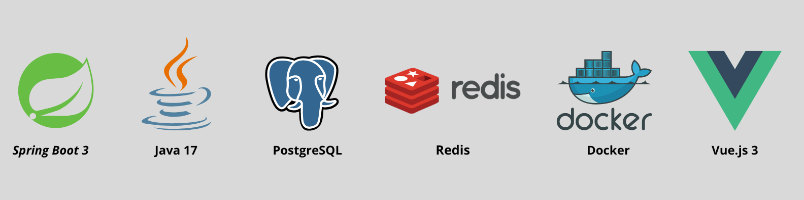
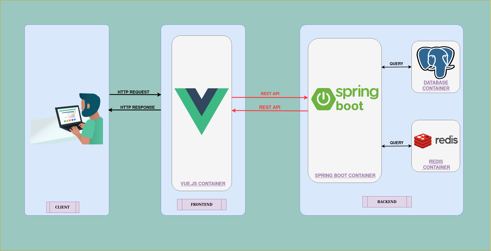

# _Stack overflow Statistics_

Welcome to the **Stack overflow Statistics** project. <br/>
The project is a web application that provides statistics about the Stack Overflow website. <br/>
We use real data from the Stack Overflow website via the Stack Exchange API to provide statistics about the
website. <br/>
We are storing just the questions for the past week and performing some analysis on them like the most used viewed
questions, the most scored questions, the number of questions related to a specific programming language, etc. <br/>

## Introduction
The Stack Overflow website is a question and answer website for professional and enthusiast programmers. <br/>
So I have decided to build a web application that provides statistics about the Stack Overflow website. <br/>
We use real data from the Stack Overflow website via the Stack Exchange API to provide statistics about the
website. <br/>
We are storing only the questions for the past week so it can be easy to provide some charts. <br/>
For the stored questions we are performing some analysis on them like the most used viewed questions, the most scored
questions, the number of questions related to a specific programming language, etc. <br/>
At the moment our related programming languages are:

* Java
* JavaScript
* Python
* C#
* C++
* PHP
* Ruby
* Go
* Swift
* Kotlin

We are also providing scheduled tasks to update the questions since the questions can be even closed, answered, getting
more votes, etc. <br/>
We are also providing scheduled tasks to store more questions. <br/>

Here is a video that shows the project:


https://github.com/NidhalNaffati/stackoverflow-statistics/assets/100954462/7209dd30-9ee2-49b2-b2c6-f15c3b3818ec


## _Technologies Used_

Those are the main technologies used in this project:


## _Requirements_

* Having **Java 17** or later installed. <br>
  You can download it
  from [Oracle's website](https://www.oracle.com/java/technologies/javase/jdk17-archive-downloads.html).


* Having **PostgreSQL** DataBase installed, or you can fire up an instance of PostgreSQL using the docker-compose file
  provided in the
  project. <br>
  Install **PostgreSQL** from [PostgreSQL's website](https://www.postgresql.org/download/).


* Having **Redis** installed, or you can fire up an instance of Redis using the docker-compose file
  provided in the
  project. <br>
  Install **Redis** from [Redis's website](https://redis.io/download).


* Having **Node.js** installed. <br>
  You can download it from [Node.js's website](https://nodejs.org/en/download/).

## _Run the application_

1. Clone this repository to your local machine using this
   command : <br/> `git clone https://github.com/NidhalNaffati/stackoverflow-statistics.git`
2. Import the project into your IDE.
3. Open the `.env` file located in `backend folder` and update the environment variables with your own values.
4. Open the `application.yml` file located in `src/main/resources/` and update the database credentials with your own.

  ```yaml
spring:
  datasource:
    url: jdbc:postgresql://${POSTGRES_HOST:localhost}:${POSTGRES_PORT:5432}/${POSTGRES_DB:postgres} # if the host is not specified, it will be localhost, if the port is not specified, it will be 5432 and if the database is not specified, it will be postgres
    username: ${POSTGRES_USER:postgres} # if the username is not specified, it will be postgres
    password: ${POSTGRES_PASSWORD:postgres} # if the password is not specified, it will be postgres

  redis:
    host: ${REDIS_HOST:localhost} # if the host is not specified, it will be localhost
    port: ${REDIS_PORT:6379} # if the port is not specified, it will be 6379
    time-to-live: 60 # the time to live in seconds
```

4. Run the backend via your IDE, or using the Maven plugin `mvn spring-boot:run`.
5. Run the frontend via your IDE, or using the following command `npm run dev`.
6. Open your browser and navigate to `http://localhost:5173`.

## _Architecture_

Global Diagram of the application:


## _Note_

The application is using the stack exchange API to get the questions from the Stack Overflow website. <br/>
The current problem is that we are limited to 10,000 requests per day. <br/>
So if you are just testing the application and playing around with it, you will not have any problem. <br/>
But if you are using it for a long time, you will have to create your own application in the stack exchange website and
use your own API key. <br/>

```yaml
stack-exchange:
  api-key: Ve4rjNkrFc*ZJqf25pA2ZA((
  base-url: https://api.stackexchange.com/2.2
```

## _Contributing_
If you want to contribute to this project and make it better with new ideas, your pull request is very welcomed. <br/>
If you find any issue just put it in the repository issue section, thank you.
